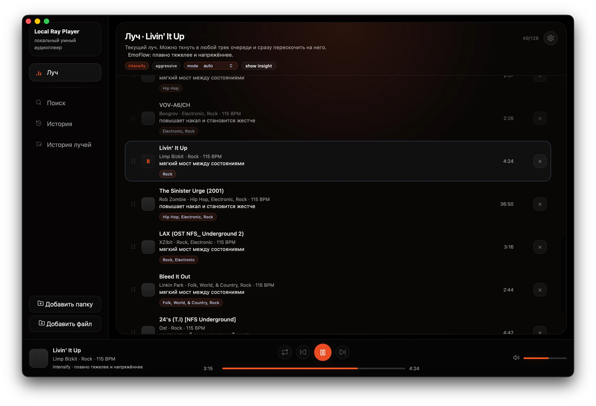

# 🎵 Ray Player: Автоматический составитель музыкальных плейлистов 🎧✨

> Где мощь Go встречается с красотой Web, чтобы создавать десктопный музыкальный шедевр.

[](https://golang.org/dl/)
[](https://wails.io/)
[](https://svelte.dev/)
[](https://onnx.ai/)
[]()

---

## Что это за магия? 🤔

Добро пожаловать в мир **Ray Player** — это не просто музыкальный плеер, это **интеллектуальный компаньон**, который понимает тебя и твою музыку. Забудь про скучные плейлисты с ручным подбором треков!

**Ray Player** — это автоматический составитель музыкальных плейлистов «лучей», где треки подбираются так, чтобы гармонично сочетаться между собой. Минималистичный тёмный интерфейс, где цвет-акцент меняется под настроение музыки.



> **Что умеет Ray Player?** 🎧
>
> *   **🎶 Автоматические плейлисты-лучи**: Алгоритм «EmoFlow» строит плейлист как эмоциональную траекторию — треки подбираются по принципу гармоничного сочетания, с плавными переходами и возможностью исследовать новые композиции.
> *   **🧠 ML-анализ аудио**: CNN-модели Essentia (ONNX) извлекают тембр, ритм, текстуру и настроение из аудио — локально, без облаков. Дополняется собственным анализом спектральных характеристик для построения эмоционального профиля каждого трека.
> *   **📊 15-осевой эмоциональный профиль**: Каждый трек описывается в пространстве из 15 непрерывных осей (Joy, Melancholy, Serenity, Combat, Pressure, Roughness, Brightness, Motion, Swagger и др.) + 16 дискретных эмоциональных меток через DAG-классификатор.
> *   **🔍 Кластеризация и текстовый анализ**: K-means кластеризация и анализ метаданных (исполнитель, жанр, теги) помогают находить связи между треками, но без жёсткой привязки — плейлист сохраняет свободу для неожиданных комбинаций.
> *   **🧭 Режимы траектории**: WarmUp, CoolDown, Deepen, Explore — управляют эмоциональным «перемещением» плейлиста, от разогрева к углублению, с возможностью открывать свежие треки.
> *   **🎨 Цвет под музыку**: Минималистичный тёмный интерфейс, где акцентный цвет автоматически выбирается на основе играемого трека — от тёмно-красного (combat) до бирюзового (serene), через фиолетовый (night_smooth) и оранжевый (joy_party).
> *   **📈 Audit-инструменты**: CLI-команды `audio_probe_batch` и `ray_audit` для визуализации эмоциональной классификации и проверки переходов между треками.
> *   **🔐 Privacy-first**: Вся библиотека, анализ и рекомендации работают локально. Никаких серверов, никаких данных за пределами твоей машины.

---

## Фишки, от которых мурашки 🍭

*   🎨 **Цвет под музыку**: Интерфейс живёт вместе с музыкой — акцентные цвета меняются в зависимости от эмоционального настроения играемого трека.
*   🌓 **Тёмная сторона силы**: Автоматическое переключение тем. Устал от света? Интерфейс поймет тебя без слов.
*   🧠 **ML без облаков**: Весь анализ аудио выполняется локально с помощью ONNX-моделей — твои данные остаются на твоей машине.
*   🎯 **Интеллектуальный подбор**: Алгоритм «EmoFlow» понимает эмоциональное содержание музыки и строит плейлисты, которые резонируют с твоим настроением.
*   🚀 **Lightweight**: Упаковывается в крошечный бинарник. Быстро скачивается, мгновенно запускается.
*   📂 **Простота использования**: Просто укажи папку с музыкой — плейлист будет создан автоматически.

---

## Путь Джедая: Установка и Запуск 🛠️

### 1. Подготовь почву (Go)
Тебе нужен **Go 1.25+**. Установи его для своей платформы:
*   **Windows**: Скачай с [официального сайта](https://go.dev/dl/) и установи
*   **macOS**: `brew install go`
*   **Linux**: Скачай с [официального сайта](https://go.dev/dl/) и добавь в PATH или установи через пакетный менеджер:
    *   `sudo apt install golang-go`

Проверь установку:

```bash
go version
```

---

## Разработка и вклад

Инструкция для разработчиков, правила ML-изменений и pipeline Pull Request находятся в [CONTRIBUTING.md](CONTRIBUTING.md).

Быстрый старт:

```bash
npm ci --prefix frontend
just hooks
just deps
just dev
```

Перед PR:

```bash
just format
just test-all
```

## Сборка portable-версии

```bash
just build-portable
```

Команда подготавливает runtime-зависимости, собирает Wails-приложение и добавляет ONNX Runtime, FFmpeg, MiniLM и Essentia assets в `build/bin` или внутрь macOS `.app`.

Поддерживаемые release targets:

- macOS arm64;
- Windows amd64.

macOS amd64 не включён в официальный release matrix, потому что используемая версия ONNX Runtime не публикует совместимый официальный x86_64 runtime. Системную или самостоятельно собранную библиотеку можно указать вручную в настройках.

## GitHub Releases

Тег `vX.Y.Z` запускает `.github/workflows/release.yml`. Workflow выполняет нативную сборку на macOS arm64 и Windows amd64, формирует ZIP и SHA-256, затем создаёт или обновляет GitHub Release.

macOS-архив по умолчанию не notarized. Для публичной массовой дистрибуции добавьте отдельный signing/notarization job с Apple Developer ID secrets; не храните сертификаты в репозитории.

## Лицензия

Код проекта распространяется по GNU General Public License v3. Полный текст — [LICENSE.md](LICENSE.md). Лицензии сторонних моделей и библиотек перечислены отдельно в [THIRD_PARTY_NOTICES.md](THIRD_PARTY_NOTICES.md).

### 2. Призови Wails
Wails — наш главный дирижер. Установи его одной командой:
```bash
go install github.com/wailsapp/wails/v2/cmd/wails@latest
```

### 3. Волшебная палочка: Just
Чтобы не запутаться в командах, мы используем **Just** — умный инструмент для запуска рецептов. Установи его:
*   **macOS**: `brew install just`
*   **Windows**: Скачай [тут](https://github.com/casey/just/releases) и добавь в PATH, или установи через пакетные менеджеры:
    *   `cargo install just`
    *   `npm install -g rust-just`
    *   `pipx install rust-just`
*   **Linux**: `sudo snap install just` или из репозитория.

Теперь все команды запускаются из корня проекта одной строкой! 🪄

### 4. Зависимости для ML и аудио
Для работы с ONNX-моделями Essentia и обработки аудио установи:
*   **macOS**: 
    ```bash
    brew install onnxruntime ffmpeg
    ```
*   **Windows**: 
    ```bash
    winget install -e --id Gyan.FFmpeg
    ```
    Или скачай с [официального сайта FFmpeg](https://ffmpeg.org/download.html) и добавь в PATH.
    
    Для ONNX Runtime следуй инструкциям в [официальной документации](https://onnxruntime.ai/docs/get-started/)
*   **Linux**: 
    ```bash
    sudo apt install ffmpeg
    ```
    Для ONNX Runtime следуй инструкциям в [официальной документации](https://onnxruntime.ai/docs/get-started/)

---

## Как это крутить? 🎮

### Режим Разработчика (Live Reload)
Меняй код и сразу видишь результат. Чистый кайф! Запускай из корня:
```bash
just dev
```

### Сборка Финального Артефакта
Готов отправить программу другу? Собери её в готовый файл:
```bash
just build
```
Ищи результат в папке `./build/bin/`.

### Тестирование
Проверь, что всё работает как часы:
```bash
# Быстрый тест
just test

# Глубокий тест с гонками (перед коммитом)
just test-race

# Очистка кэша тестов и запуск
just test-clean
```

### Аудит аудио
Анализируй свою музыкальную библиотеку:
```bash
# Анализ аудио в папке
just audio-probe /path/to/your/music
```

---

## Технологический Стек 2025 🤖

*   **Backend**: Go (🐹 суровый, но добрый хомяк)
*   **Frontend**: Svelte 4 (🎨 реактивность без лишнего мусора)
*   **Bridge**: Wails v2 (🔗 мост между нативным кодом и Web)
*   **ML Engine**: ONNX Runtime + Essentia CNN модели (🧠 локальный анализ аудио)
*   **Audio**: beep/v2 (🎵 кроссплатформенное воспроизведение)
*   **Database**: SQLite (💾 локальное хранение метаданных)
*   **DSP**: go-dsp (📊 спектральный анализ)
*   **Vibe**: Glassmorphism & Modern CSS

---

### Дисклеймер 🎈
*Сделано для обучения, фана и во имя красивых интерфейсов. Автор не несет ответственности за чрезмерное удовольствие от использования интеллектуальных плейлистов.* 😉

**Ставь ⭐, если твоя музыка тоже хочет быть услышанной по-новому!**

---

_Happy listening! 🎵✨_
